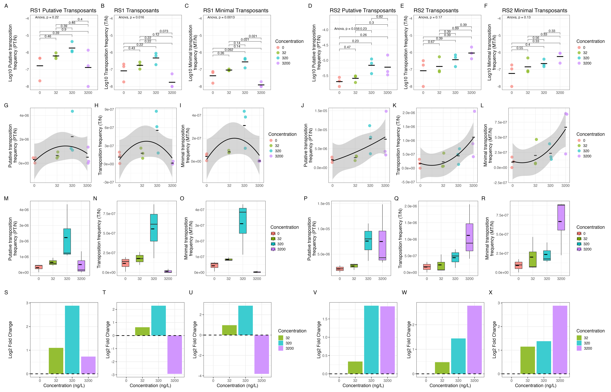

# Ceftriaxone concentration effects on transposition frequency

> View as a [web page](https://rngoodman.github.io/CRO-concentrations-Tn-frequency/) or [Github repository](https://github.com/rngoodman/CRO-concentrations-Tn-frequency) 

This repository includes the code used to run the analysis in a study currently posted as a preprint on bioRxiv:

[**Effects of different concentrations and combinations of antibiotics on the dynamics of intracellular transposition in *Escherichia coli***](https://doi.org/10.64898/2026.07.24.740473)

Richard N. Goodman, Ellinor Shore, Michael S. M. Brouwer, Peter Nambala, Nicholas Feasey, Nina Langeland, Sabrina J. Moyo, Andrew Singer, Adam P. Roberts

*bioRxiv* ; doi: [https://doi.org/10.64898/2026.07.24.740473](https://doi.org/10.64898/2026.07.24.740473)

The code used in the analysis is linked below for the **genomic visualisation of plasmids with circulize and gggenes** (Figures 1 and 4), **transposition frequency analysis** (Figure 2, 3, Figures S1-3) and  **insertion site analysis** (Figure 5, Figure S4). Python scripts used to reorient plasmids and parse them from genbank to csv files for genomic vislisation are also included in the repository.

## Part 1 - Genomic visualisation of replicons

### Part 1.1 - [Python script - Reorientating plasmid sequences to *repE*/*oriV* genes](https://github.com/rngoodman/CRO-concentrations-Tn-frequency/blob/main/scripts/reorient_plasmid.py)

### Part 1.2 - [Python script - Parsing genbank files to csv files for genomic visualisation](https://github.com/rngoodman/CRO-concentrations-Tn-frequency/blob/main/scripts/parse_genbank_to_csv.py)

### Part 1.3 - [R script - Genomic visualisation of RS1 and RS2 (Figure 1)](https://github.com/rngoodman/CRO-concentrations-Tn-frequency/blob/main/code/1_genomic_visualisation_RS1_RS2.R)

### Part 1.4 - [R script - Genomic visualisation of pBACpAK derivatives with Tn/IS inserts (Figure 4)](https://github.com/rngoodman/CRO-concentrations-Tn-frequency/blob/main/code/4_genomic_visualisation_pBACpAK_inserts.R)

## Part 2 - Transposition frequency analysis 

### Part 2.1 - [R script - Analysing the effect of ceftrixone concentration on CFU/ml in RS1 and RS2 (Figure 2)](https://github.com/rngoodman/CRO-concentrations-Tn-frequency/blob/main/code/2_RS1_RS2_CFU_per_ml.R)
 

### Part 2.2 - [R script - Correcting for clonal expansion](https://github.com/rngoodman/CRO-concentrations-Tn-frequency/blob/main/code/Correcting_for_clonal_expansion.R)

### Part 2.3 - [R script - Transposition frequency analysis of  PT, T and MT (Figure 3, Figure S3)](https://github.com/rngoodman/CRO-concentrations-Tn-frequency/blob/main/code/3_S3_Transposition_frequency_analysis_RS1_RS2.R)

### Part 2.4 - [R script - Variance (SEM) and difference (LFC) in PT, T and MT transpostion frequencies (Figure S2-3)](https://github.com/rngoodman/CRO-concentrations-Tn-frequency/blob/main/code/S1_S2_Tn_freq_SEM_and_LFC_RS1_RS2.R)

## Part 3 - Insertion site analysis 

### Part 3.1 - [R script - Insertion site analysis (Figure 5, Figure S4)](https://github.com/rngoodman/CRO-concentrations-Tn-frequency/blob/main/code/5_S4_Insertion_site_analysis.R) 

